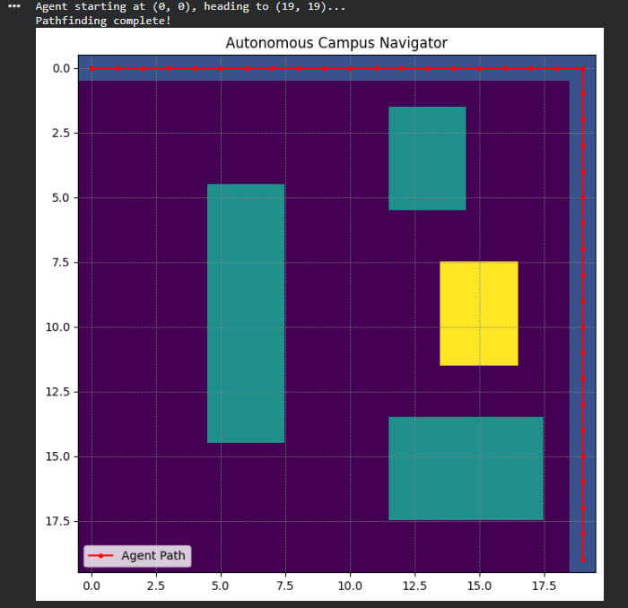

# 🚀 Stochastic Campus Navigation Agent

## 📌 Overview
This project implements a Goal-Based Rational Agent that navigates a campus grid using:
- A* Search Algorithm
- Probabilistic Risk Assessment
- Expected Cost Optimization

The agent chooses the most efficient path by balancing:
✔ Shortest distance  
✔ Traffic-based delay probabilities  

---

## 🎯 Objective
To design an intelligent agent that:
- Avoids obstacles (buildings)
- Handles uncertainty (traffic zones)
- Minimizes expected travel cost

---

## 🧠 Concepts Used
- Artificial Intelligence (Agents & Environment)
- A* Search Algorithm
- Manhattan Distance Heuristic
- Probability Theory
- Expected Value (Statistical Decision Making)

---

## ⚙️ Technologies
- Python 3
- NumPy
- Matplotlib

---

## 🧩 Problem Setup
- Grid Size: 20 × 20
- Obstacles: Buildings (blocked cells)
- Traffic Zones: Probabilistic delays

---

## 🧮 Cost Function
Expected Cost:

E(Cost) = (1 - P(D)) × 1 + P(D) × (1 + Penalty)

---

## 🔍 Algorithms Used

### 1. BFS (Baseline)
- Explores all directions equally
- Not efficient

### 2. A* Search (Main)
- Uses heuristic:
  
  h(n) = |xg - xn| + |yg - yn|

- Optimizes path using:
  
  f(n) = g(n) + h(n)

---

## 🏃 How to Run

```bash
pip install -r requirements.txt
python main.py
```
---
## 📊 Output
- Grid visualization
- Optimal path
- Traffic-aware decision making
- 

---

## 🔮 Future Work
- Reinforcement Learning integration
- Real-world deployment using Raspberry Pi
- Dynamic data-based environment

---

## 📚 References
- Russell & Norvig – Artificial Intelligence
-NumPy Documentation
- Python Docs

---

## 👩‍💻 Author

Tanisha Sethi
BTech AI & ML
